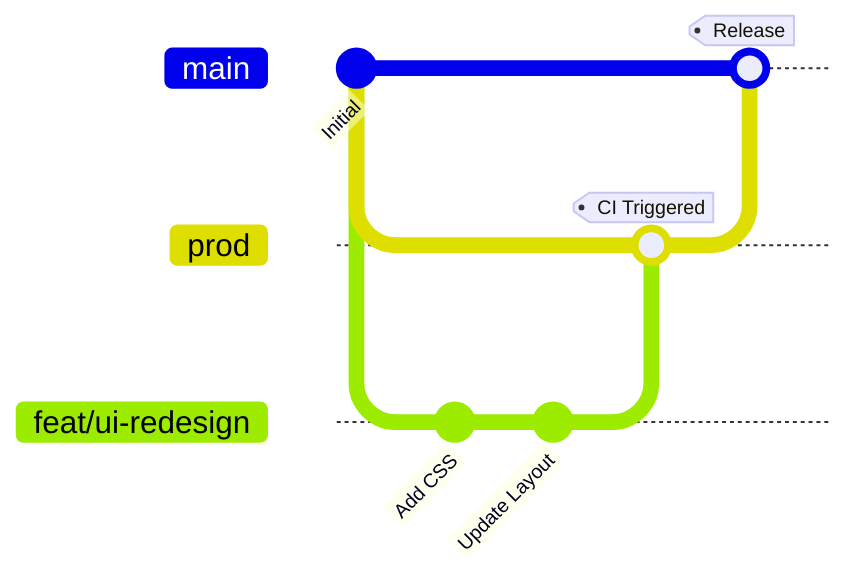

# TwentyAndFiveEyeRest

A professional, cross-platform eye rest reminder application built with C++.

## Overview

TwentyAndFiveEyeRest helps you maintain eye health by reminding you to take breaks using the 20-20-20 rule (though customizable). The application tracks your screen time and detects when your screen is locked to manage your rest status accurately.

## Getting Started

### Prerequisites
These can be installed via the install scripts mentioned below.  
- **CMake** (v3.20 or higher)
- **G++** (with C++17 support)
- **Boost Libraries** (filesystem, system, unit_test_framework)
- **Ninja Build System** (recommended for speed)

> [!NOTE]
> `spdlog`, `nlohmann-json` and `CLI11` are vendored within the `vendor/` directory and do not require system-wide installation.

### Installation (Linux)

You can use the provided `install.sh` script to install dependencies:

```bash
chmod +x scripts/install.sh
./scripts/install.sh
```

### Building and Running

The project includes a manager script `run.sh` to simplify building, testing, and running.

#### Using the Manager Script

```bash
chmod +x scripts/run.sh
./scripts/run.sh
```

The script provides an interactive menu:
1. **Run (Debug CLI)**: Runs with `-d` flag for verbose output.
2. **Run (Normal)**: Runs without extra parameters.
3. **Configure**: Runs CMake configuration.
4. **Build**: Compiles the project using all available cores.
5. **Run Tests**: Executes the test suite.
6. **Clean**: Deletes the build directory.

#### Manual Build (Without scripts)

```bash
mkdir build && cd build
cmake .. -G Ninja
cmake --build .
./bin/TwentyAndFiveEyeRest
```

## CLI Parameters

The application supports the following command-line arguments:

- `-d, --debug`: Enable debug logging.
- `--check-lockscreen`: Probes lock detection methods on your system and helps you choose the best one.
- `--reset-settings`: Resets `settings.json` to default values.

## Settings Configuration

Settings are stored in `settings.json` in the project root. The file is structured to include metadata:

```json
{
    "work_minutes": {
        "name": "Work Minutes",
        "explanation": "Duration of work before a break",
        "value": 20,
        "min": 1,
        "max": 120,
        "unit": "minutes"
    }
}
```

- **value**: Change this to customize your experience.
- **min/max**: Constraints for numerical values.

## Git Branching Strategy

This project follows a professional branching model to ensure stability and control CI costs.

### Branch Overview

- `main`: The stable branch containing the latest released code.
- `prod`: The staging branch where code is tested before merging to `main`. CI runs here.
- `feat/*` or `dev-*`: Feature branches where individual developers work. CI **does not** run here automatically.

### Workflow Diagram



### Best Practices for Collaborators

1.  **Branching**: Always create a new branch from `prod` for any feature or bug fix (e.g., `feat/my-new-feature`).
2.  **Naming**: Use descriptive names like `feat/description` or `fix/issue-id`.
3.  **Pull Requests (PRs)**: 
    - Submit PRs targeting the `prod` branch.
    - Ensure your code builds and passes tests locally (`./scripts/run.sh test`) before submitting.
4.  **Merging**:
    - Avoid direct pushes to `main` or `prod`.
    - Once a PR is approved and CI passes on `prod`, it can be merged into `main` for release.
5.  **CI Triggers**: CI build is initiated only when merging into `main` or `prod`. Feature branches do not trigger CI to save resources and avoid noise.

## Testing

Run tests using the manager script:
```bash
./scripts/run.sh test
```
Or manually using `ctest` inside the `build` directory.
